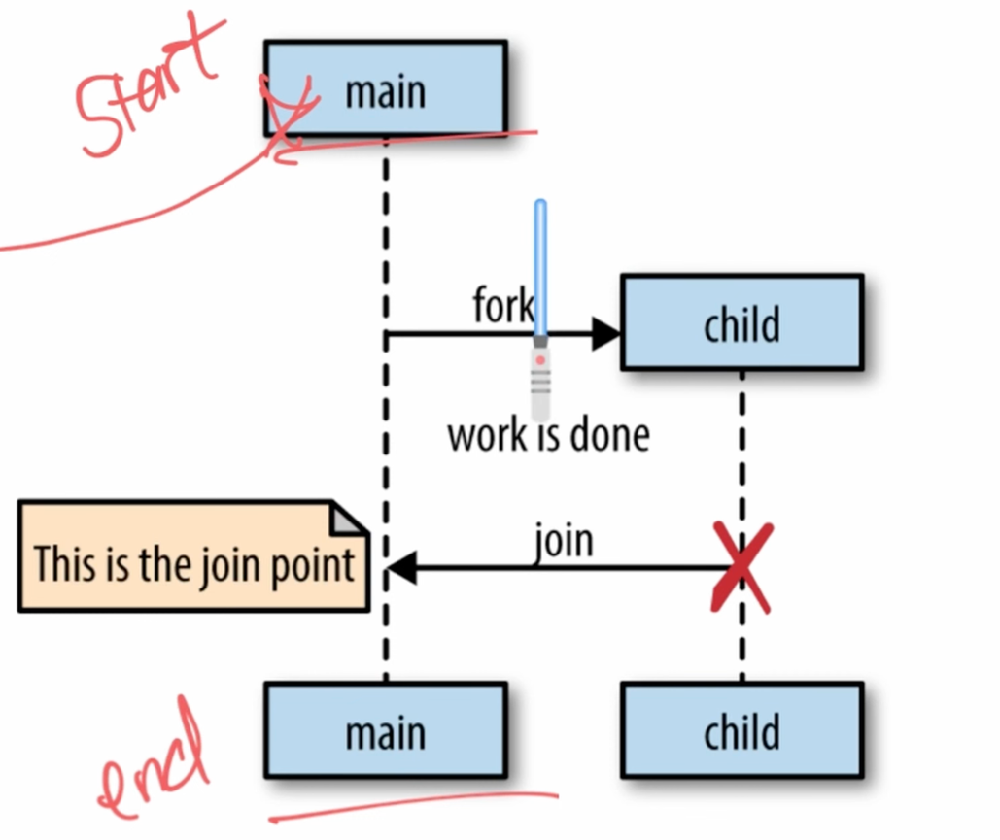
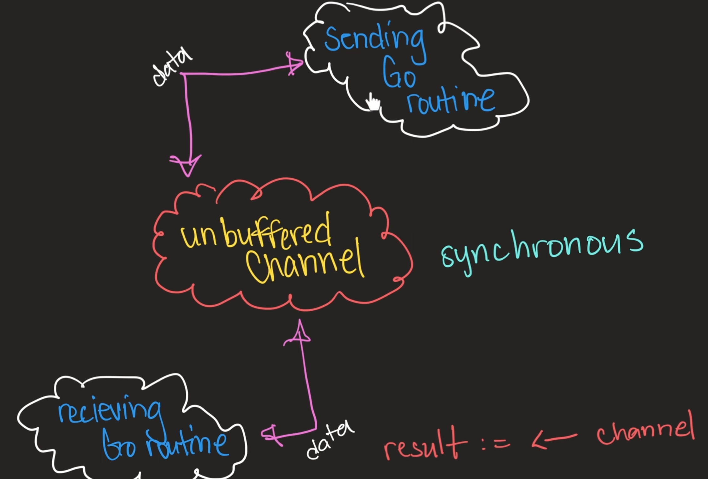

Go uses channels for values to be passed around, and never shared by separate threads of execution.
Only one goroutine has access to the value at a time.

"Do not communicate by sharing memory; instead, share memory by communicating."

Go routine: a function executing concurrently with other goroutines in the same address space.
Lightweight, costs little more than allocation of stack space. Stacks start small and cheap, grow by allocating and freeing heap storage as required.

multiplexed onto multiple OS threads. If one blocks, others continue to run.

Go concurrency follows the Fork-Join pattern -  we are responsible for implementing the rejoining of the child process to the main process


```
Anonymous functions
A function without a name.

func(a int, b int) int {
    return a + b
}

We can call it immediately.
result := func(a int, b int) int {
    return a + b
}(2, 3)

fmt.Println(result) // 5

definition + call in one
and it can be stored in a varable

CLOSURES
Anonymous functions can capture variables from outside:
message := "hello"

func() {
    fmt.Println(message)
}() <<<< calls it - we need the () otherwise it's just being defined and not executed

Useful when:
You want to run custom inline logic
You don’t want to define a separate named function
You want to capture variables from the surrounding scope
```

Using function literal (anonymous function) with goroutines
```go
go func() {
    time.Sleep(delay)
    fmt.Println(message)
}()
```

1. Defines the anonymous function
2. calls it with ()
3. runs it in a goroutine (without () the function is called but never executed)

“function literals are closures: variables referred to by the function survive as long as they are active”
the anonymous function remembers variables

functions have no way of signaling completion

WaitGroup = java's CountdownLatch
Unbuffered Channel = java's SynchronousQueue
Buffered Channel = java's BlockingQueue

CHANNELS
Used to communicate info between goroutines
they can reference the same place in memory - where a channel would reside

goroutine 2 reads from a channel
goroutine 3 writes on a channel

channels are like FIFO queues. 


SELECT 
lets a gorotine wait on multiple communication operations

default (unbuffered) - used to perform synchronous communication between goroutines
guarantees an exchange is performed at the instant the send and receive actions happen

Sending go routine is blocked until there's a receiver receiving the data from the unbuffered channel
Once the receiver receives the data, the sending go routine is no longer blocked

buffered - way to make communication asynchronous
queue-like functionality
we send data, and forget about it (up to the alloted capacity)
limtied capacity
no corresponding receiver

sender go routine sends and can keep sending, up to the capacity of the channel
it gets blocked if the channel is full. then it has to wait for the data to be received so that it can send more.

Done Channel - Allows parent go routine to cancel its children 

----

They key is to remove structural barriers to parallelism
Study real-world systems for inspiration
